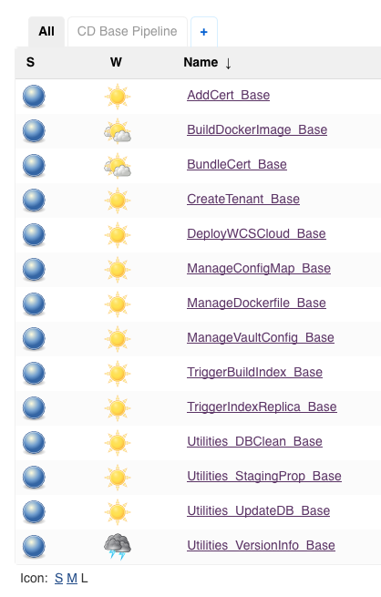

# Deploying WebSphere Commerce V9 with the DevOps Utilities #

WebSphere commerce DevOps Utilities are provided as a reference tool chain to support deploying and operating WebSphere Commerce V9 in a Kubernetes environment.

For more information about WebSphere Commerce V9, see [WebSphere Commerce Version 9 knowledge Center](https://www.ibm.com/support/knowledgecenter/SSZLC2_9.0.0/landing/wc_welcome.htm).

By using WebSphere Commerce DevOps Utilities, you can also deploy WebSphere Commerce V9+ in IBM Cloud Private (ICP). For more information on ICP, see [IBM Cloud Private](https://www.ibm.com/cloud/private).

WebSphere Commerce DevOps Utilities are built and deployed as Docker images, including the following:
* DeployController
* DeploySlave
* SupportContainer
* Jenkins Slave Plugin Container

Docker image |  Embedded assets  | Role and description
------------- | -------------| -------------
DeployController | Jenkins/ Pre-defined Jenkins job/ DevOps backend scripts |  A Jenkins-based tool to work as the controller to trigger related jobs and fulfill tasks such as environment deployment and Docker image build
DeploySlave  | Dockerd / Helm client / DevOps backend scripts | Can be triggered by DeployController to build customized Docker image including your customization package and can then be deployed in the Kubernetes environment  with Helm
SupportContainer | DevOps backend scripts | Handles Helm pre- and post-deployment hook/ Works as commander to control the startup sequence
Jenkins Slave Plugin Container | Jenkins Agent | A Jenkins slave using JNLP to establish connection ( You can download it from [jenkinsci/jnlp-slave](https://hub.docker.com/r/jenkinsci/jnlp-slave/)

Vault and Nexus Docker images, by default, are seamlessly integrated with the DevOps Utilities.

In the WebSphere Commerce DevOps utilities:

 * [Vault](https://www.vaultproject.io/) works as the Certification Agent to automatically issue certification as well as the remote configuration center to store environment related configurations. These configurations can be retrieved during Docker startup and set environment-specific configurations into the Docker container. For more information about Vault, see [Managing certificates with Vault](https://www.ibm.com/support/knowledgecenter/SSZLC2_9.0.0/com.ibm.commerce.install.doc/refs/rigcertificates_vault.htm) and [Environment data structure in Consul/Vault](https://www.ibm.com/support/knowledgecenter/SSZLC2_9.0.0/com.ibm.commerce.install.doc/refs/rigvaultmetadata.htm).

 * [Nexus](https://www.sonatype.com/nexus-repository-sonatype) works as the store to manage your customization packages. The customization packages are retrieved from Nexus and burned into the custom docker image when the custom Docker image is built.

You can deploy the DevOps Utilities by using Helm Chart. For more information about Helm Chart, see [Commerce DevOps Utilities Helm Charts](https://github.com/IBM/wc-helmchart)

The following diagram shows the components of the WebSphere Commerce using DevOps Utilities.<br>
  <br>

## Design Principle ##
1. What IBM can deliver? So far, our better option (since there is no best option) is to keep it open instead of building up the technical boundary and constraint.. This is a technical ecosystem keeps evolving extremely fast.  This is one of the most important motivation when we decided to open source it in Github as reference. Which give clients a referrable starting point to start their v9 journey.

2. Is there a common topology or common deployment mechanism, in On-prem customers world?   "How To" and "Why" is more important than just know "What". It will be clients to make the serious business decision to determine the topology and mechanism to service their critical business.. Meanwhile, we need to respect the business and infrastructure diversity in real world.

3. We did realize client has strong demand to customize the pipeline to fulfill their specific business requirement.. So we should and have to illustrate the technical detail in terms of how the pipeline works crossing the infrastructure. That translate to be the current delivery model in Github in terms of the granularity and the detail level we need to orchestrate and enable clients to consume.

## Design ##

* [Architecture Design](doc/ArchitectureDesign.md) <br>
* [DeployController Design](doc/DeployControllerDesign.md) <br>
* [Utilites Design](doc/UtilitiesDesign.md) <br>
* [DeploySlave Design](doc/DeploySlaveDesign.md) <br>
* [Logging Solution Design](doc/LoggingSolution.md) <br>

## Preparing Docker images for DevOps Utilities ##

Before you deploy WebSphere Commerce V9, build all required Docker images for WebSphere Commerce DevOps Utilities.

Before you run build Docker images, ensure that your machine has Docker (DockerCE or EE  17.06) installed and that your machine is connected to the Internet.

1. Go to the  `commerce-devops-utilities/kubernetes/DeployController` directory, and run the following command to build the DeployController Docker image:

        ./BuildDocker.sh

    **Note**: you can specify the Docker image tag in the following pattern:
        
        ./BuildDocker.sh deploycontroller:<newtag>

    The `kubernetes/DeployController` folder contains the following files for customization:
      * `plugins.txt`: Includes New or updated plugin version
      * `setup/jobs`: Includes pre-defined Jenkins job.
      * `users/admin/config.xml`: Includes the default admin user information
      * `config.xml`:Includes global variables for Jenkins
      * `jenkins.sh`: Includes Jenkins startup logic

2. Go to the `commerce-devops-utilities/kubernetes/DeploySlave` directory, and run the following command to build the DeploySlave Docker image:

   ```
   ./BuildDocker.sh
   ```
    **Note**: You can specify the Docker image tag in the following pattern:
    
        ./BuildDocker.sh deployslave:<newtag>

3. Go to the  `commerce-devops-utilities/kubernetes/DeploySupport`directory, and run the following command to build the DeploySupport Docker image:
   ```
   ./BuildDocker.sh
   ```
   **Note**: You can specify the Docker image tag in the following pattern:
   
       ./BuildDocker.sh supportcontainer:<newtag>


## Deploying DevOps Utilites ##

### Before You Begin ###

Please follow this [Guide](doc/SetupDevOpsSystem.docx) to setup platform and all support tooling

> Note:

1. This guide is based on ICP, but you can use pure Kubernetes
2. All tooling in guide are not mandatory, you can based on your understand to replace any of them you familiar with

### Deploy DevOps Utilities ###

To quickly deploy DevOps Utilities, you need to use Helm Chart. For more information about Helm Chart, see [Commerce DevOps Utilities Helm Charts](https://github.com/IBM/wc-helmchart/tree/master/WCSDevOps).

Ensure to deploy WebSphere Commerce DevOps Utilities under the `default` Kubernetes namespace.

Some people may have confuse about words above. Here I want to clarify that this `DevOps utilities tool can support deploy Commerce V9 enviorment on multiple namespace. We just recommed user deploy this deploycontroller in default namespace.` The resason are:

1.  There have a little hard code with "default" namespace if using InCluster Mode start deploycontroler to detect Vault, so if you using InCluster mode to let deploycontroller to auto detect Vault and get Vault Token, it has limitation so far. We welcome anyone can make this change to fix it and contribute to this project

2.  We suggest the user to deploy deploycontroler in `default` namespace, becasue it don't have RBAC limitation. This can make user can quick try this solution and evolution self-host solution based on this git project without worry about How to set RBAC 

If you want to deploy deploycontroler on non-default namespace, please create below RBAC on your target namespace with default service account.

```
kind: Role
apiVersion: rbac.authorization.k8s.io/v1
metadata:
  name: wcs-devops-deploy-role
rules:
- apiGroups: [""] 
  resources: ["secrets"]
  verbs: ["get", "watch", "list","create","delete","patch","update"]
- apiGroups: [""] 
  resources: ["persistentvolumeclaims"]
  verbs: ["get", "watch", "list","create","delete","patch","update"]
- apiGroups: [""] 
  resources: ["pods","pods/log"]
  verbs: ["get", "watch", "list","create","delete","patch","update"]
- apiGroups: [""] 
  resources: ["configmaps"]
  verbs: ["get", "watch", "list","create","delete","patch","update"]
---
kind: RoleBinding
apiVersion: rbac.authorization.k8s.io/v1
metadata:
  name: wcs-devops-deploy-rolebinding
subjects:
- kind: ServiceAccount
  name: default
  namespace: ${namespace}
roleRef:
  kind: Role
  name: wcs-devops-deploy-role
  apiGroup: rbac.authorization.k8s.io
```

**Note**: If you already have a WebSphere Commerce V9 environment deployed, or you do not want to deploy Utilities on the Kubernetes cluster or ICP, you can also manually deploy each DevOps utilities container to serve your existing environments.

After the deployment is completed, you can access the DeployController user interface by logging into `http://IngressIPAddress:31899` with the default user name and password (`admin/admin`), and check the following pre-defined jobs:

<br>

**Tip**: <br>
1. For each job in DeployController, make sure to open the `config` page and click `Save`, so that the Parameter plugin can be loaded.

2. Before you launch Jenkins Job, please make sure you have upload related Docker Image to private Docker Repository
   As default, Jenkins Job will download Docker Image under "commerce" library with latest tag from private Docker repository which you set in DeployController.


## Using WebSphere Commerce Utilities ##

Suppose you already [setup the DevOps utilities env](doc/1_SetupDevOpsSystem.docx)

Basiclly, Commerce environment live-cycle compose with three stages:

1. [Initial deployment](doc/2_HowToDeployCommerceV9.docx)
   
2. [Package custom code and build custom Docker image](doc/DeployControllerDesign.md)
    
3. [Update existed environment with custom Docker image](doc/3_HowToUseDevOpsUtilitiesToBuildCustomizationDockerImage.docx)

4. [Optional: Run Daily Job](doc/DeployControllerDesign.md)

### Project structure  ###
The following table shows the folders included in the project.

Folder |   Description
------------- | -------------
doc | Includes documents created in Markdown
utilities/DeployController | Includes the scripts for building DeployController Docker Image
utilities/DeploySlave | Includes the scripts for building DeploySlave Docker Image
utilities/DeploySupport | Includes the scripts for building SupportContainer Docker Image
utilities/Filebeat | Includes scripts to build Filebeat Docker Image for Commerce V9. See [Logging Solution](doc/LoggingSolution.md)
utilities/EventAgent | Includes source code (golang) and scripts to build EventAgent Docker Image for Commerce V9. This Docker Image support pre-defined job "KubeExec_Base" which can exec command (e.g run engine command to set trace spec) on specified Pod
scripts |  Includes DevOps backend scripts


## Contributing to the project ##

After you try the DevOps utilities out, you are welcomed to contribute to this project by enriching the files list above and improving the documents.

If you'd like to do so, contact the administrators in the [contact list](CONTACT.md) so that you can be added as a project member.

You can also create issues directly to propose enhancements. We will evaluate and assign project members to fix or handle issues.

#### Related links ####

* Slack Channel

* [Contact list](CONTACT.md)

##  Others ##
* [History](CHANGETRACK.md)
