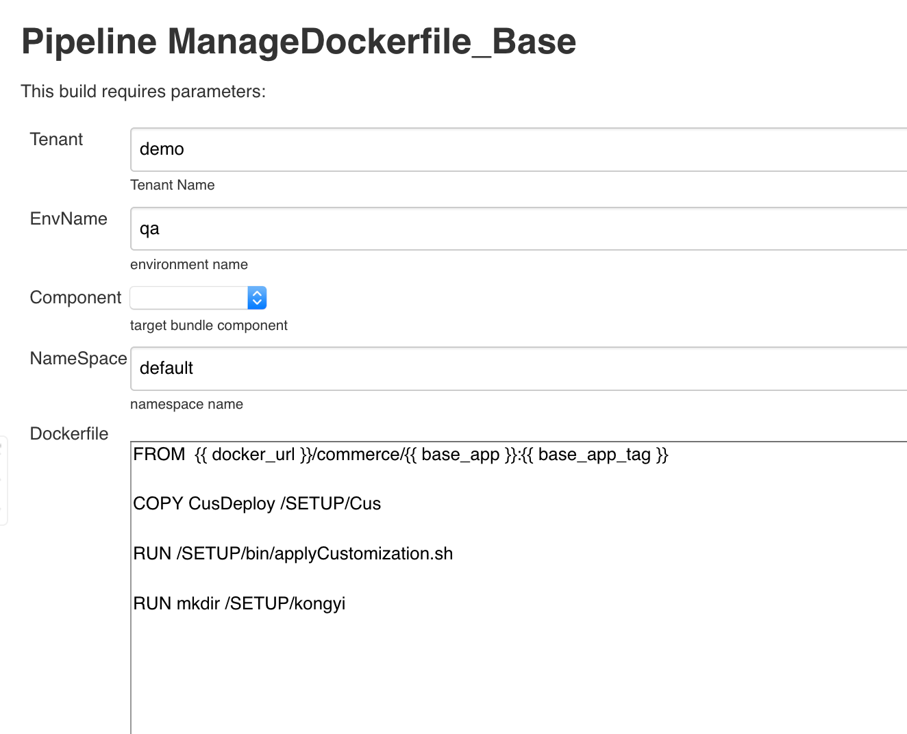

# Develop and Build Customize Code #
  The operator David has already set up a WebSphere Commerce v9 init environment and he pass the environment to the
  developer Steve. The steve begin to try the V9 out of box functions. The steve found the most of functions can meet
  his requirements, but he think there are still some gaps between the oob functions and their required functions. So
  he wants to do the customization based on the oob v9. Before he begin to do the task,  he want to check how to do the
  customize for v9. The steve found the v9 knowledge center has detail instructions about [customization](https://www.ibm.com/support/knowledgecenter/SSZLC2_9.0.0/com.ibm.commerce.base.doc/concepts/cdedeveloping.htm).
  It show all customization methods and customization points. Until now, steve has known how to do the customization, but
  David remind him v9 is a dockerized application, maybe you not only consider how to develop the customization codes, but
  need to consider how to deploy the codes in the dockerized environment. Based on David's suggestion, steve begin to search
  deployment customization related topic in V9 knowledge. He found V9 has defined a standard about [packaging customized code]
  (https://www.ibm.com/support/knowledgecenter/SSZLC2_9.0.0/com.ibm.commerce.developer.doc/concepts/cdewcbdoverview.htm)
  and [deploying it to docker image](https://www.ibm.com/support/knowledgecenter/SSZLC2_9.0.0/com.ibm.commerce.install.doc/tasks/tiginstall_updatedocker.htm). 
  And It also provide a customization tool to help build a customization package according
  to the defined standard.
  
  * After steve has set up the basic knowledge about the new standard, steve begin to develop his customization code and
  package them to a standard package by WCB Tool.
  
  * Once the customization package is ready, steve pushes it to a code repository. He uses this code repository to do the
  version control. 
  
  * Steve begins to define their customize docker file by jenkins job "ManageDockerfile". Based on steve's input "Dockefile"
  content, this job save the content to a configmap in K8S environment. The configmap name format is like this: ${tanant}-${env}-${conponentname}-dockerfile
  
   
  
  * Run "BuildDockerImage" job to build the specific customized image. In this job, the key info is Build info. In the build info field,
  steve define which components he wants to build, which base image and customization package he wants to use,
  ,what is the new image name, what is the customization Dockerfile.  This job will find dockerfile configmap according to the
  docker file name firstly. If not found, it will search the default dockerfile based on tenant name, env name, component name. 
  Then this job will download the customization package according to the bundle info. If the bundle info is 
  full url, This job will download the customization package from this url. if not, it will download specific version package from
  default nexus repository. At the last, build the image based on the dockerfile and downloaded customization package.
  The whole build process is finished in a temporary jenins slave pod. This pod is created by the job in the begining according to
  the docker in docker image. The image include a docker daemon, so the pod can build a docker image.
  
   
 
  
  {
     "name":"ts-app",  // component name (base image name)
     "base":"v22", // base image tag
     "bundle": "1.1.2", // bundle version in default nexus repository or customizaiton package download url
     "version": "v1",  // new docker image tag 
     "dockerfile": ""  //  corresponding config map name
},
  
 