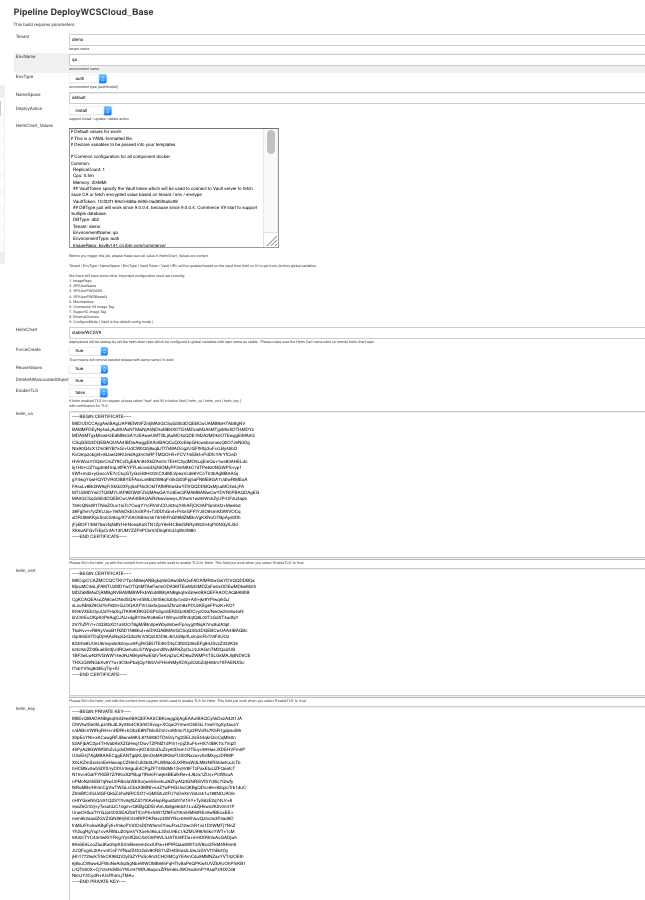

# Init tenant environment #
  Once the infrastructure is ready, the operator David need to plan to set up a tenant in the infrastructure. 
  The tenant is like subsidiary of big company which is composed of many separate subsidiaries. Each subsidiary 
  should take charge of all things for itself. A tenant shoulld be separate and isolate to other tenants as the
  subsidiary. The namespace in kubernetes can help implement tenant resource isolation. Each tenant should have
  own namespace, which will reduce the impact of each other.
  
  A subsidary has many different department to handle different work. The tenant like the subsidary has different 
  environment to handle diffentent requirement, such as dev environment, qa environment, pre-production environment
  and production envioronment. The topology of dev envronment and qa environment may be different from pre-production
  and production environment, which should be a minimal environment including all the components. The pre-production 
  and production environment should set up the topology based on the business requirements. 
  This chapter will take the qa environment as an example.
  
   
  

  After the deployment topoloy is defined, the operator David want to prepare database server and load data firstly. 
  About how to do them, the David can reference the [WebSphsere Commerce v9 info center](https://www.ibm.com/support/knowledgecenter/en/SSZLC2_9.0.0/com.ibm.commerce.install.doc/tasks/tiginstalldb2overview.htm).
  Until now, the operator has already set up the infrastruture and database server, the David is happy to say that 
  he can begin to create a tenant by the deployed devops utility. 
  * Login the deploy controler(jekins master), default password is admin/admin. The David see all available jobs.
  
   
  * The David use "CreateTenant_Base" job to create tenant. By default the job will create a tenant info in vault 
  configuration center so that he can manage the configuration info in vault.  According to the sceen shot, David choose
  the default way to create this first tenant. This tenant will share the common jenkins job view and common CA which is
  created by vault utility. Once he is familiar with all jobs and deployment follow, he maybe want to use the advantaged
  feature. He want to create to specific view in jenkins UI by setting the parameter "CreateDedicatedView" as true. After 
  the view is available, he can create different users and different roles, he assign the different authority to different
  role. He can make sure that each role can only do the tasks what he can really can do. And David want to set up a ca for
  this tenant by setting the parameter "DedicatedRootCA" as true.  He think the specific CA can help improving the secruity.

    
  * David pushes his db info, merchantkey info, spiuser info to vault configuration center for this environment of this 
  tenant by running the "	ManageVaultConfig" job.

    
  * After the configuration center is ready for this tenant, David begin to use "DeployWCSCloud" job to deploy the WebSphere
   Commerce V9 environment.This job will create jenkins slave pod , register it to jenkins master and init the helm client 
   use helm repository defined in jenkins global environment variables. Then update the values.yaml of helm chart by the 
   input value content. At last the slave will use the v9 stale WCSV9 helm chart to deploy WebSphere Commerce V9 environment.
   The WCSV9 helm chart takes charge of deploying the search, store, transaction, ts-web components. And it also create and 
   configure ingress and secret to make sure the all services can be accessed. 

    
  
  
  
  
  