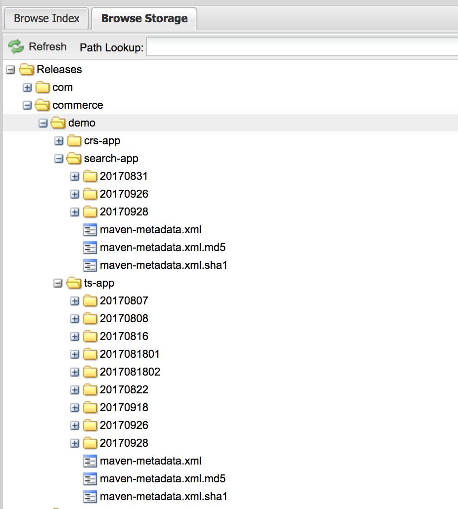

# Prepare Infrastructure #

## Background ##
( IF you don't want to read the role based story, you can jump to next session "Retrospective" ) <br>

After David get this mission, he talked with Steve and made agreement that since Steve need more time to understand how V9 work and
how to do customization on V9, so David can start up prepare the Infrastructure first. Even though David think this is a mission impossible in short time, but he still start action.

David is a senior operator over 10 years and a big fan with Docker, before start to prepare the infrastructure, He did a Google search and find the Commerce V9 Knowledge Center
[Commerce V9 Knowledge Center](https://www.ibm.com/support/knowledgecenter/SSZLC2_9.0.0/landing/wc_welcome.htm)

After read this Knowledge, he get know below points and have related thinking :

1. Commerce V9 is Docker based <br>
: Docker is good for operation but he need to choose a orchestration tool to support he manage container's life-cycle. (He knew Kubernetes is very popular, he has tried that before, it is awesome). He also
award that mange Docker Image is new challenge, he must setup a Docker Repository for store Docker Image

2. Commerce V9 support customization and need user build customization code on out of box Docker Image <br>
: Since each component has independent customization package. David award that he must setup
a repository to help manage version of customized package. So far they are using Nexus. Maybe he can reuse it to make the customized package be store on it as a assets.

3. Commerce V9 has independent customized build process for each component <br>
:  David knows that to customize build need write Dockerfile and need to associated correct customized code. Since Commerce V9 delivered 5 Docker Image, that means there at least
have 5 Dockerfile for them and for different people, they may want to change Dockerfile for different purpose. So far, he just run the Docker build on virtual machine and he just have one server for that. In feature, if there have lots of people want to build docker image
this server can not handle this. If he prepare several virtual machine for build docker image, that would be a huge cost, because each virtual machine will consume money at second ( IT team is belongs to another BU, apply virtual machine need charge money based on the use of time).
If not people build Docker Image, but machine keep there, the money still will be charged by second. This moment, He vaguely remember that someone mentioned `Docker Build In Docker` technology. He think this maybe helpful.

4. Commerce V9 support do configuration for each docker container when it startup with different mode. <br>
: He knew the remote configuration center is very important for the distribute system. It can use to store environment related configuration data. From Commerce V9 Knowledge Center
He find Vault/Consul is the default supported RMDB. He think that's great, he want to try it.  Meanwhile he also noticed that Commerce V9 can support config with ConfigMap, that is awesome!
He want to take more time to figure out how Commerce V9 suggest to organized data on Vault.


5. Commerce V9 Provide Helm Charts <br>
: Helm Charts is very populate to group Kubernetes template
and support deploy. David think this good point can support deploy more efficient and more easier to manage. David have tried the Helm Charts, he know
if plan to use Helm Charts, it would be better to have Helm Repository to manage different version of Helm Charts.


After list all those points. David award that this is a real big project which is beyond his think. The key point that David there have lots of tool chain
but how to integrate them together. He need to build a "hub".


David is a very lucky person. When David is struggling on how to make so many tool chain work together, someone told him IBM has published a github project [IBM/wc-devops-utilities](https://github.com/IBM/wc-devops-utilities)
After read the design doc, David very happy to tell Steve he found the treasure. [IBM/wc-devops-utilities](https://github.com/IBM/wc-devops-utilities) is the Hub can help you to make all tool chain work together

With this DevOps utilities chain, he can easily to build up pipeline to support Commerce V9 deploy on Kubernetes

David draft a compare table to list the key points he want to implement with capacity DevOps utilities can provide.  With this table, David told Boss, the mission is not impossible

Utilities Support  |  David's Think
------------- | -------------
Build Customization Docker In Docker | Need Support different people build docker at same time and the build resource should be apply on demand and save cost.
Deploy with Helm In Slave Container  | Reuse Helm Charts which provide by IBM which can better control deploy and easy to manage
Manage Config On Vault | Vault is the default support RMDB which can used to manage different
Manage Dockerfile On ConfigMap | For different environment need different Dockerfile
Manage Tenant Environment | There must have several environment like dev -> qa -> pre-prod -> prod

David take quick action. He plan to rely on DevOps utilities tool to build up he's pipeline on Kubernetes. Of course, he need to setup some
other assistant tooling. To make whole


## Retrospective  ##
After ready the story of David. Hope you can understand what assistant tool you need to prepare with DevOps Utilites to make the infrastructure ready.

Before deploy DevOps utilities, you need to setup
1. Kubernetes Cluster ( 1.7 + ) or ICP ( 2.1.0.1 )

Kubernetes Component   |  Usage
------------- | -------------
Flanel | Provide per-container-per IP capacity
Sky-DNS | Provide DNS parse
Ingress| Provide Loadbalance capacity
Helm Server| Communicate with Helm Client and Kuberentes to deploy Kubernetes object

   IF you setup ICP, those dependent component already be included.

2. Vault/Consul ( You can use WCSDevOps Helm Charts deploy it )

   IF you use WCSDevOps Helm Charts to deploy Vault/Consul with DevOps Utilites together. The DevOps Utilites will
   do initial setup. But if you want to setup Vault/Consul by your self. You need to enable PKI backend your-self with
   below commands:

   ```
        #begin to mount pki backend
        export vault_token=VaultRootToken
        export data='{"type": "pki", "description": "SelfServe Root CA", "config": {"max_lease_ttl": "87600h"}}'
        curl --header "X-Vault-Token: $vault_token" --request POST --data "$data" http://VaultIPAddres:8200/v1/sys/mounts/selfserve_production_pki
        #Generate root ca
        export data='{"common_name": "selfserve_production_pki Root CA", "ttl": "87600h", "key_bits": "4096","exclude_cn_from_sans": "true"}'
        curl --header "X-Vault-Token: $vault_token" --request POST --data "$data" http://VaultIPAddres:8200/v1/selfserve_production_pki/root/generate/internal
        #Generate issue certificate role
        export data='{"key_bits": "2048", "max_ttl": "87600h", "allow_any_name": "true"}'
        curl --header "X-Vault-Token: $vault_token" --request POST --data "$data" http://VaultIPAddres:8200/v1/selfserve_production_pki/roles/generate-cert
   ```

3. Nexus ( This is not mandatory, it you don't want to manage the customization package with it )

   IF you plan to use Nexus to manage customization package. Here is sample about how to organize package under 'release' repository

   <br>

   ```
   <dependency>
     <groupId>commerce.demo</groupId>  //demo is the tenant name
     <artifactId>search-app</artifactId> //search-app is the component name
     <version>20170831</version> //20170831 is the package version
    <type>zip</type>
   </dependency>
   ```

    It would be very easy to integrate with your current build pipeline. Just need to call gradle publish scritps
    to publish package to Nexus. Here is the sample gradle scrips for publish

4. Helm Repository

   If you have Helm Client, You can use below command to start up a Helm Repository
   ```
    helm serve --repo-path HelmRepoPath --address ServerIpAddress:8879
   ```

   Then you can put the WCSV9 Helm Charts under HelmRepoPaht and Run below command to package it and add into index
   ```
   helm package ./WCSV9
   helm repo update
   ```

   After finish that you can check HelmRepoPath/index to see if there have WCSV9 version record in it.

5. Docker Repository

   There have lots of way to setup Docker Repository, you can search how to setup Docker Repository on internet.

## DevOps Utilities Deploy  ##

1. Deploy DeployController ( as default, it should be deploy on default namespace )
see [Commerce DevOps Utilities Helm Charts](https://github.com/IBM/wc-helmchart)

( Note: Vault/Consul and Nexus are option. If you already have them, you can just deploy DeployController )

2. Upload DeploySlave and SupportController

   * Create a new project named as "commerce"
   * Upload DeploySlave and SupportController to Docker Repository under "commerce" project with latest tag
     ( In DeployController, as default, it will download DeploySlave and SupportController from DockerRepo/commerce with latest tag. IF you want to make change, please change the Jenkins Job Config )

3. Please make sure all global configuration in DeployController be set appropriately

 <br>

 <br>

