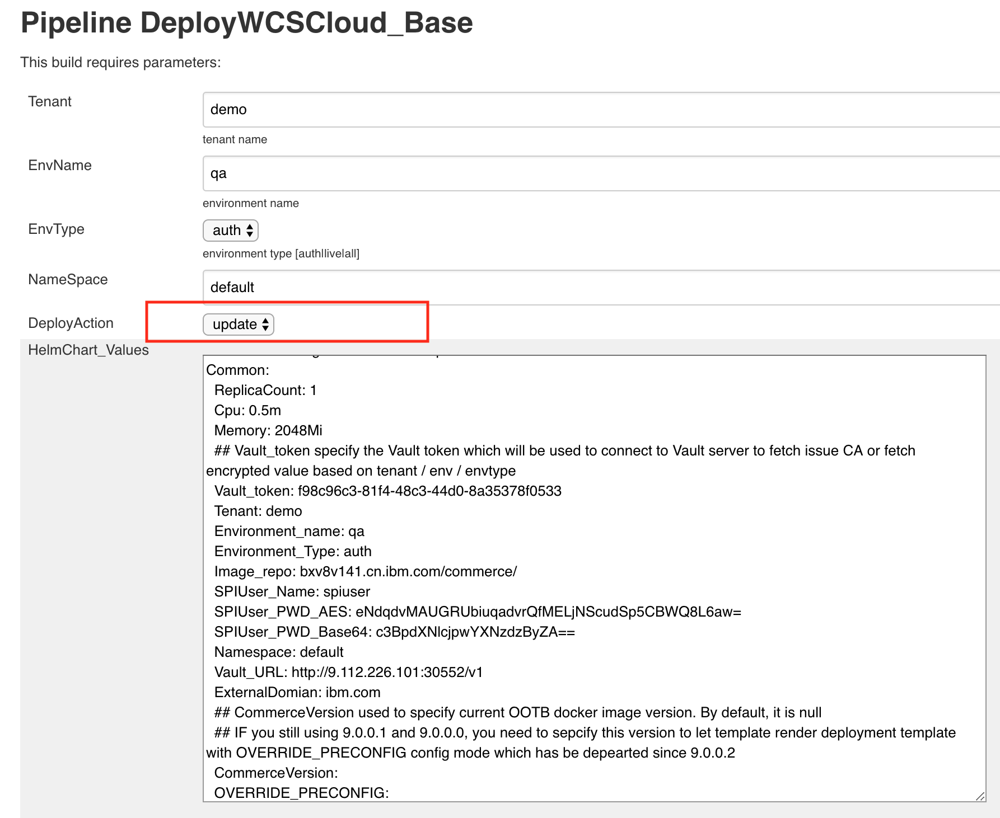

# Update Env with Customized Docker Image #
  Steve has finished his development work and built a customized docker image. He wants the test team to verify
  the new function. So he makes a request to David about updating the environment with the latest customized docker image.
  David approves this request happily, because updating a docker environment is very easy. Before David begin to update the
  environment, he wants to confirm the following information with steve.
  
  1. Have the customized image been pushed to docker registry?
  
  2. What are the customized image tags?
  
  3. The configuration info in configuration center need to be added or updated?
  
  Steve told David that he has already pushed the image to docker registry. Please use the new latest customization image.
  No need to update configuration center. Please begin to update the environment.
  
  David check the jobs in jenkins UI and find that the job "DeployWCSCloud" can help update environment.
  
  * David open the job "DeployWCSCloud", modify the "HelmChart_Values" field, change the tag for each component image.
    
  * David choose the "update" as the deployAction, run the job. This job will start a new pod. This pod will register to
  jenkins master as a temporary jenkins slave node. Then the pod will update helm default value and deploy the WCSV9 environment
  by the stable helm chart.
  
   
  
  
 
  
  
  
  